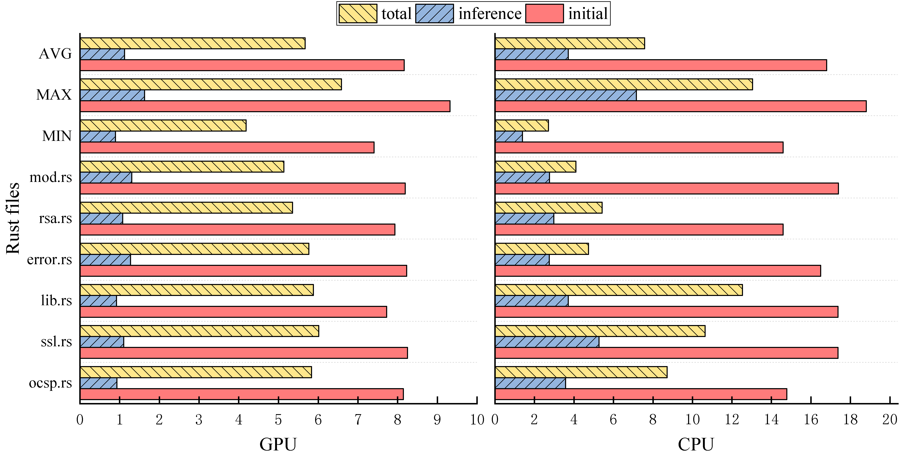

# Classify unsafe Rust code

For each function in Rust, the `unsafe` keyword utilizes the unsafe superpowers. However, the `unsafe` keyword is not necessary if it can be taken out while the program is compiled successfully.

`curs` infers the necessity of `unsafe` keywords without the need of recompiling. `curs` trains a [microsoft/codebert](https://github.com/microsoft/CodeBERT) based model and take advantage of bert's strong reasoning capability to inference the necessity of `unsafe`.

`curs` support three forms of runtime environment including on `Rust curs`, `Python curs`, `Pypi curs`.

## `Performance`

It costs 2.06s and 2.90s on average for `Rust curs` inferencing one rust file on Intel I7-12700K CPU and NVIDIA 3080 12GB GPU, seperately.

`Rust curs` achieves up to 6.58X and 13.04X performance speedup over `Python curs` for GPU and CPU, seperately.

<center>Inference speedup of Rust curs over Python curs</center>

## `Rust curs`
### Runtime dependencies for rust curs
```bash
sudo apt install build-essential cmake pkg-config libssl-dev wget zip git
```
Download the `tree-grepper` vendor:
```bash
bash ./scripts/runtime.sh
```
It uses `libtorch-1.12.0` to inference curs. Download the libtorch with CPU or CUDA from following links:
```bash
CPU: https://download.pytorch.org/libtorch/cpu/libtorch-cxx11-abi-shared-with-deps-1.12.0%2Bcpu.zip
CUDA: https://download.pytorch.org/libtorch/cu116/libtorch-cxx11-abi-shared-with-deps-1.12.0%2Bcu116.zip
```
Unzip the file and set the environment path in .bashrc:

```bash
export LIBTORCH=$libtorchDir$/libtorch
export LD_LIBRARY_PATH=${LIBTORCH}/lib:$LD_LIBRARY_PATH
source .bashrc
```
or in 'envConfig' of work directory:
```bash
export LIBTORCH=$libtorchDir$/libtorch
export LD_LIBRARY_PATH=${LIBTORCH}/lib:$LD_LIBRARY_PATH
source envConfig
```
### Prepare rust data for curs test:
50 rust files for testing is elaboratly selected from open-source rust project including on `rust-openssl`, `tokio`, `anyhow`, `hyper`, `rand`, `regex` and `rayon`:
```bash
bash ./scripts/prepare_data.sh
```
### Example usage for rust curs:

```bash
cargo run data/error.rs
```
`Rust curs` also supports classifling all rust files of one directory:
```bash
cargo run data/
```

## `Python curs` (Optional)

### Runtime dependencies for python curs

Download the pretrained code model before building the package:
```bash
wget https://huggingface.co/Vincent-Xiao/codebert-curs/resolve/main/pytorch_model.bin
mkdir -p curs/codeBERT
mv pytorch_model.bin curs/codeBERT/
cd curs
wget http://bertrust.s3.amazonaws.com/tbcnn.zip (Optional)
unzip tbcnn.zip
```
Install the python requirements
```bash
pip install -r requirements.txt
```
If you prefer to use GPU/cuda, install PyTorch:
```bash
conda install pytorch==1.12.0 cudatoolkit=11.3 -c pytorch
```
### Example usage for python curs:

```bash
python -m curs.__main__ data/error.rs
# default, using a pretrained CodeBERT model
python -m curs.__main__ --model=codeBERT data/error.rs
# alternative using a pretrained TBCNN model
python -m curs.__main__ --model=tbcnn data/error.rs
```

## `Pypi curs` (Optional)
### Pypi curs installation:

```bash
pip install http://bertrust.s3.amazonaws.com/curs-0.0.1-py3-none-any.whl
```

## Example usage for pypi curs:

```bash
curs data/error.rs
# default, using a pretrained CodeBERT model
curs --model=codeBERT data/error.rs
# alternative using a pretrained TBCNN model
curs --model=tbcnn data/error.rs
```